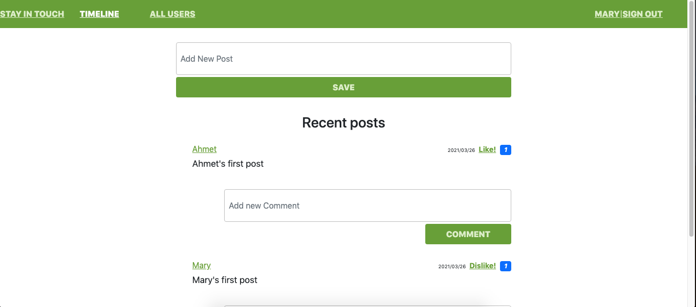

# Social media app with Ruby on Rails

## The application is created as a part requirement of the Microverse fullstack developer course

### The following functionalities are applicable in the application

    - Users are able to create accounts
    - Users are able to make friendship requests and can be requested also to be be-friended
    - User can create posts and comment on post by other users that are their friends
    - Users can like posts or dislike posts.

## Built With

- Ruby
- Rubocop
- Visual Studio Code

### Ruby version

`ruby 2.7.0`

### System dependencies

`rails 5.2.3`
`yarn 1.22.5`
`node 14.16.0`

### Configuration

Set up project using the above specifications

#### For HTTPS

- use ` https://github.com/ahmetbozaci/ror-social-scaffold.git` to clone the repository

#### For SSH

- use `git@github.com:ahmetbozaci/ror-social-scaffold.git` to clone the repository
- Change to the parent directory of the project using
  `cd private-events`
- run `bundle install ` to install dependencies
- run `yarn add ` to install dependencies
- run `rails db:migrate ` to create schema
- use `rails webpacker:install` to install webpacker
- use `rails s` to run the rails server

## Authors

👤 **Malieze Afam Ifeanyi**

- GitHub: [@chrystalme](https://github.com/chrystalme)
- Twitter: [@afam_ifeanyi](https://twitter.com/afam_ifeanyi)
- LinkedIn: [Malieze Afam Ifeanyi(chrys)](https://linkedin.com/afam-chrys)

👤 **Ahmet Bozacı**

- Github:[@ahmtbozaci](https://github.com/ahmetbozaci)
- Twitter:[@ahmtbozaci](https://twitter.com/ahmtbozaci)
- LinkedIn:[@ahmtbozaci](https://www.linkedin.com/in/ahmetbozaci/)

## 🤝 Contributing

Contributions, issues, and feature requests are welcome!

Feel free to check the [issues page](https://github.com/ahmetbozaci/ror-social-scaffold/issues).

## Show your support

Give a ⭐️ if you like this project!

## Acknowledgments

- [Odin Projects](https://www.theodinproject.com/courses/ruby-on-rails/)
- [Microverse](https://microverse.com)

## 📝 License

This project is [MIT](https://mit-license.org/) licensed.
